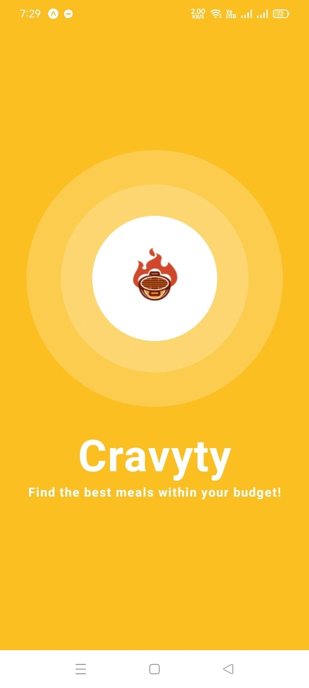
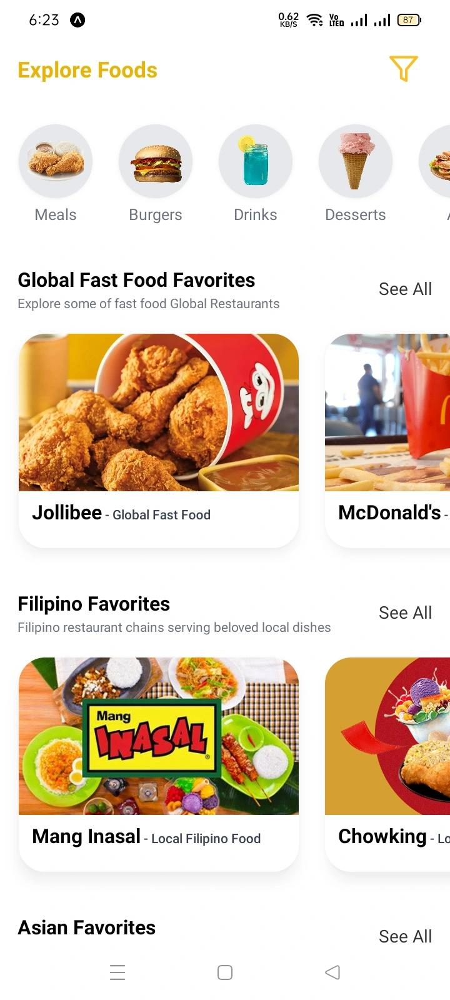
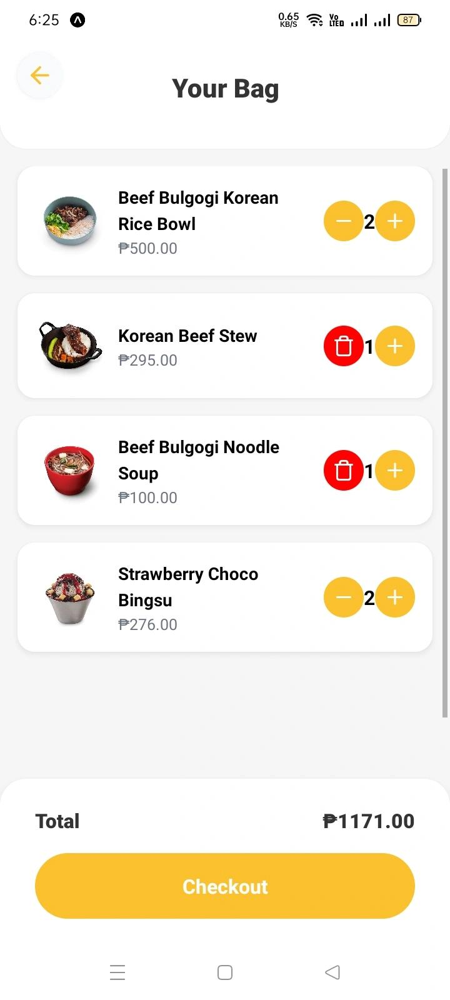
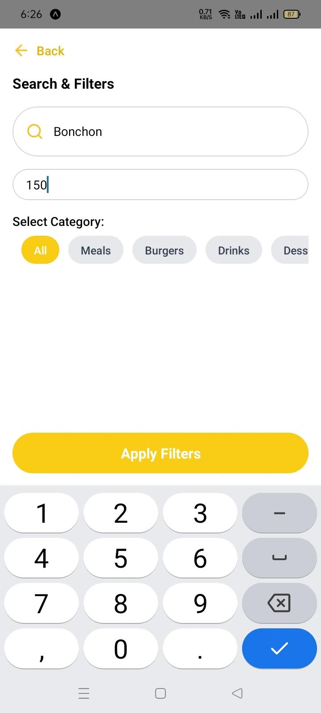
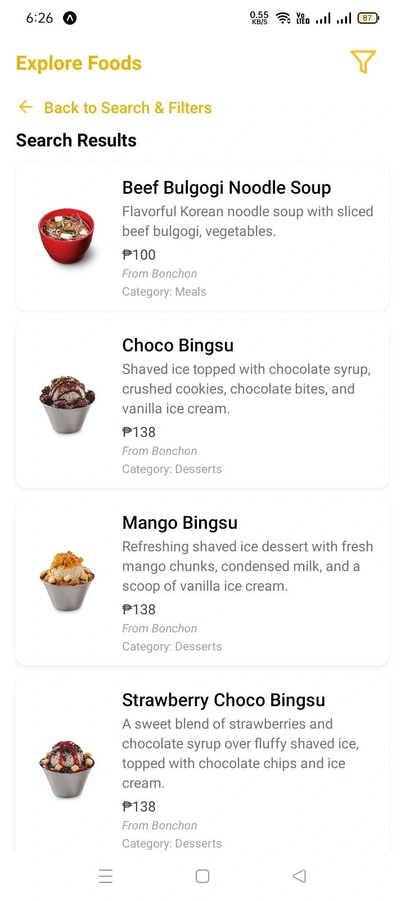
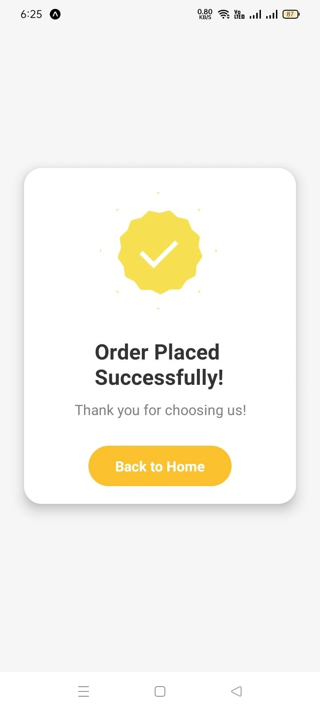

# Cravvty 🍔🥤

**Cravvty** is a React Native Expo mobile app that suggests food options based on user-selected categories and budget range.  
Developed as a final exam project for **BSIT 4B** at **East System Colleges of Rizal**.

<div align="center">
   <p>## 📸 App Preview</b>
  

  

  

  

  

  

  

  
</div>

---

## 👤 Author

**Gen Exus Vergara**  
**BSIT 4B**  
*East System Colleges of Rizal* 🎓

---

## 👥 Group Members

- **Gen Exus Vergara** *(Team Leader)*
- **Joseph Paralejas**
- **Jerson Kyle Escopin**
- **Andre Jane Padua**
- **Cyra Oyad**
- **Princess Angel Sta. Ana**

---

## 📱 Features

- 📂 View food categories: Meals, Burgers, Drinks, Desserts
- 💰 Filter suggestions based on user budget
- 🎨 Clean and colorful UI using NativeWind
- 🔄 Multi-screen navigation and order confirmation
- 📱 Optimized for Expo Go preview on mobile

---

## 🛠️ Built With

- [React Native](https://reactnative.dev/)
- [Expo](https://expo.dev/)
- [NativeWind](https://www.nativewind.dev/)
- [React Navigation](https://reactnavigation.org/)
- [Redux Toolkit](https://redux-toolkit.js.org/)

---

## 🚀 Getting Started

### 📲 Requirements

> To test the app, please use **Expo Go version 52**. You can download it below:

#### 📱 For Real Devices

- **Android:** [Expo Go v52 (Android)](https://expo.dev/go?sdkVersion=52&platform=android&device=true)
- **iOS:** [Expo Go v52 (iOS)](https://expo.dev/go?sdkVersion=52&platform=ios&device=true)

#### 🧪 For Emulators/Simulators

- **Android Emulator:** [Expo Go v52 (Android Emulator)](https://expo.dev/go?sdkVersion=52&platform=android&device=false)
- **iOS Simulator:** [Expo Go v52 (iOS Simulator)](https://expo.dev/go?sdkVersion=52&platform=ios&device=false)

Make sure your device/emulator is on the **same Wi-Fi network** as your development machine.

---

### Install dependencies

```bash
npm install
# or
yarn install
